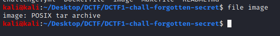

# Forgotten secret
Crypto / 100 points

## Description
We are given an file named `image` and the message:

```
Last month we hired a new junior DevOps Enginner to migrate all our services into containers.
He was super hyped about Docker and in such a hurry, that he forgot about best practices.   
You want to use one of our images? 
Sure, no problem. Just download image file, run "docker load < image" and you are ready to go!
```

## Solution
We download the file and determine that the file type is tar archive.



So let's untar it and see that is packed inside.


Open file `7dabd7d32d701c6380d8e9f053d83d050569b063fbcf7ebc65e69404bed867a5.json` and inspect the content. We find some interesting stuff:
-  Environment variable
   ```
   SECRET_KEY=58703273357638792F423F4528482B4D6251655468566D597133743677397A24
   ```
-  File path
   ```
   /home/alice/cipher.bin
   ```
-  File path
   ```
   /root/.ssh/id_rsa
   ```

Extract both files from the image.


We inspect id_rsa file and find that it is OpenSSH private key, so we need to remove the passphrase to get raw RSA private key.


Now we can use this RSA private key to decrypt cipher.bin file and get the flag.


