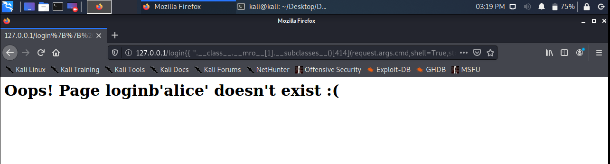
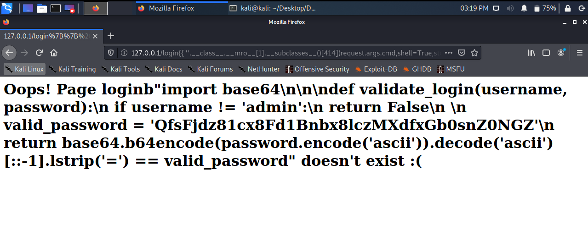

# Injection
Web / 200 points

## Description
We are given a link to the webpage and the message:

`Our local pharmacy exposed admin login to the public, can you exploit it?`

## Solution
When we open the webpage we get a login form.


We try to login using some random credentials and each time we get the following response.


The `login` endpoint doesn't exist. After we inspect the request headers we find that there's a waitress server in the backend. That's a popular Python WSGI server. After some trying we find that we have a SSTI scenario. We identify that there is Jinja2 engine used for templating the response html code.


Now we craft the RCE payload. At the end the payload looks like:
 ```
 {{ ''.__class__.__mro__[1].__subclasses__()[414](request.args.cmd,shell=True,stdout=-1).communicate()[0].strip()}}
 ```
With 414 being an index of loaded Popen library.

We test our payload with `cmd=whoami` parameter and it works! We get the name of user who is running the waitress server.



We could spawn a reverse shell, but we don't need it. With the combination of commands `ls` and `cat` we get the backend source code. File `lib/security.py` is especially interesting as it contains the login code that is missing at `login` endpoint.



The last step is to reverse engineer the login code. To get the flag we just need to inverse the `valid_password` content and then base64 decode it.


