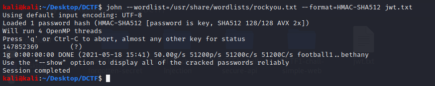

# Secure API
Web / 200 points

## Description
We are given a link to the webpage and the message:

Frontend is overrated! API rocks!

## Solution
According to the message we are dealing with API. So let's use Postman and send GET request to the given link.

We cannot access the content as we are not authenticated. Let's send POST request to `login` endpoint.

We need to specify `username` and `password` fields. What could be the guest credentials?

Great, we get the Bearer token, we try it on the main page.

We managed to get in, but we do not have the admin role. We inspect the received token and realize that we have JWT token. Let's decode it!

Great, we see `username` field that we need to modify. But before that we need to crack secret key that is being used for signing JWT tokens. We try with rockyou wordlist as we know that API rocks :)

Now we set `username` field value to `admin` and sign the token with secret value `147258369`

Copy newly created token to Postman and try to access the main page again and we get a flag.

