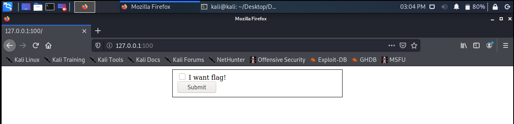
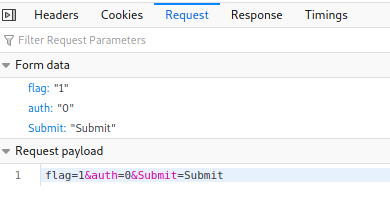
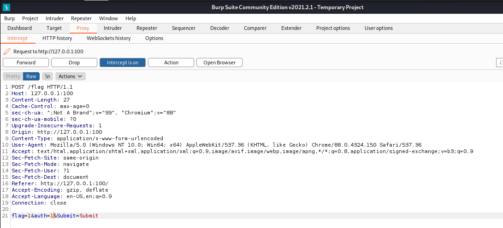
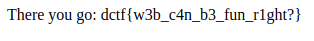

# Simple web
Web / 100 points

## Description
We are given a link to the webpage and the message:

`Time to warm up!`

## Solution
When we open the webpage we spot a form with one checkbox and the submit button.

When we press on the submit button we always get "Not authorized" message back regardless of whether the checkbox is selected or not.

We continue with inspecting the request and find that there is also "auth" parameter in the payload.

Using Burp Suite we intercept the request and modify the parameter value from 0 to 1.

After that we get our flag!

